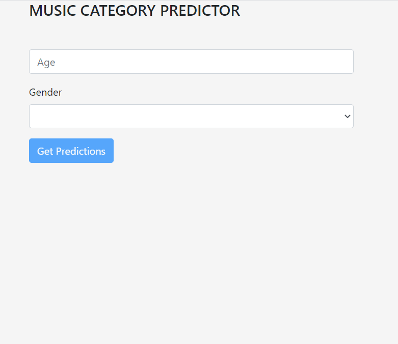
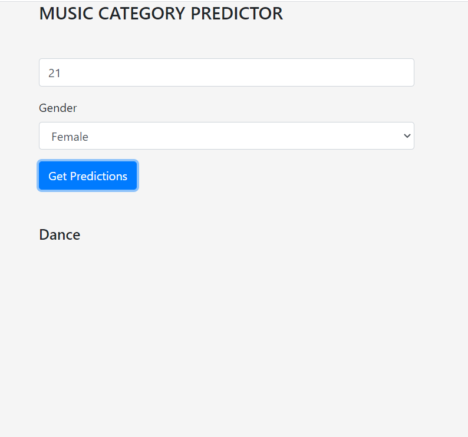
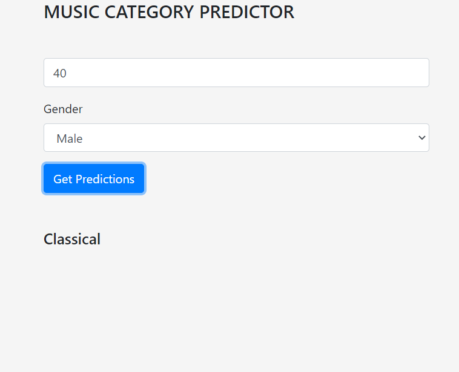

# "Machine Learning Angular front end"

## This is a pure Angular Application.

## This application takes in a person's AGE and GENDER and then RECOMMENDS a category of MUSIC the person might be interested in.

## This angular application communicates with a PYTHON FLASK REST BACKEND APPLICATION for purpose of machine Learning recommendation

## The angular application commucates thrpough REST API.

## Link to the PYTHON FLASK BACK END APPLICATION that does MACHINE LEARNING recommendation based on AGE and GENDER - https://github.com/gontsezuka/python-flask-basic-

